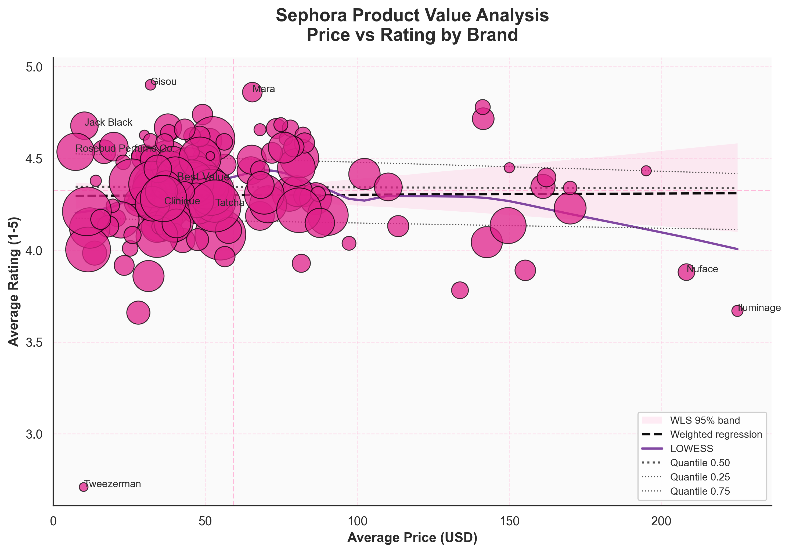
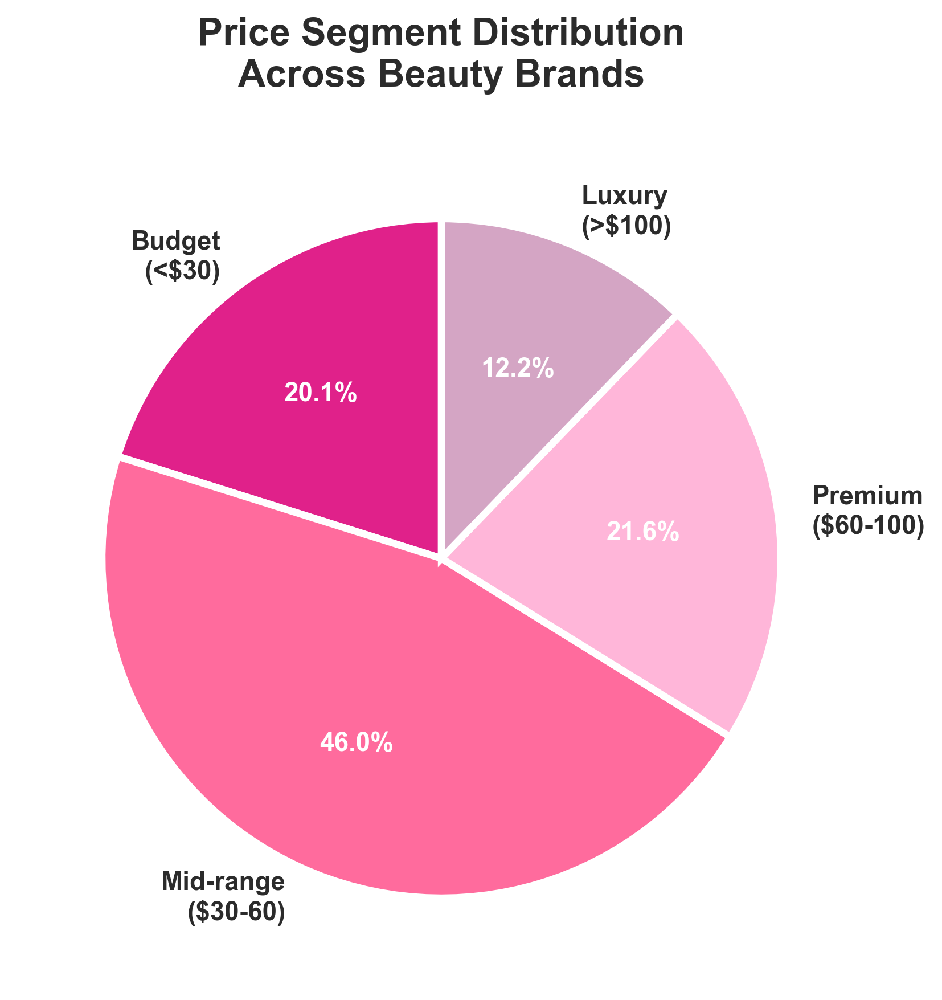
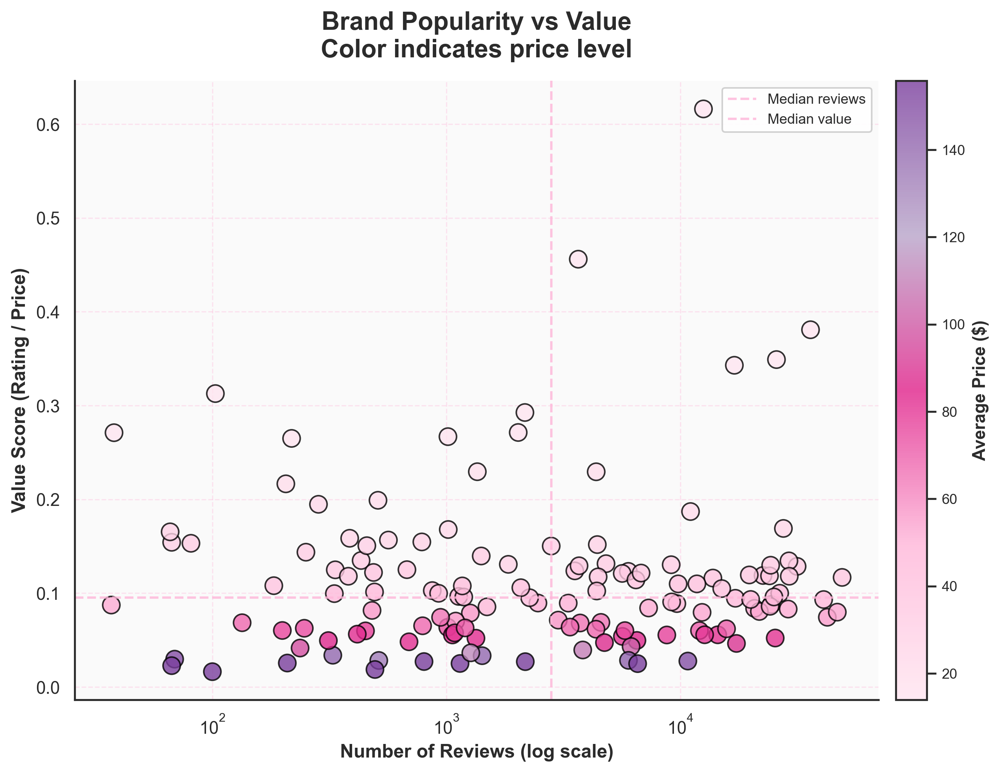
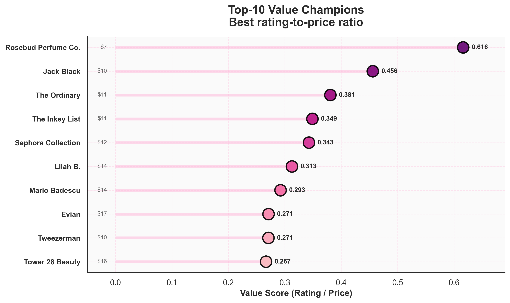

# Sephora Product Value Analysis

Final project for **INFSCI 2415 (Information Visualization)**, University of Pittsburgh  
Author: **Yingjing (Jessamine) Jiang**

---

## 1. Project Overview

This project analyzes real-world Sephora product and review data to study how **price**, **customer ratings**, **popularity**, and **value efficiency** interact across beauty brands.

### Guiding Questions
- Do higher-priced products receive higher ratings?
- Which brands deliver the best rating-per-dollar value?
- How are brands distributed across price tiers?
- Does popularity (review volume) correspond to higher value?

---

## 2. Key Results

- Price and rating show only a **weak correlation**; expensive products do not necessarily earn higher satisfaction.  
- Most brands fall into the **mid-range tier ($30–$60)**.  
- Value scores vary substantially, and many premium or luxury brands perform poorly in rating-to-price efficiency.  
- Review volume does not strongly predict value.  
- **Rosebud Perfume Co., Jack Black, and The Ordinary** rank among the strongest value-efficient brands.

A complete written summary is available in the PDF report.

---

## 3. Dataset

**Source:**  
https://www.kaggle.com/datasets/nadyinky/sephora-products-and-skincare-reviews

Files Used:
- `product_info.csv`
- `reviews_*.csv`

---

## 4. Methods

### Data Processing
- Convert ratings and prices to numeric formats  
- Remove invalid rows  
- Winsorize price outliers (1st–99th percentile)  
- Normalize brand names  
- Aggregate brand-level stats (rating, price, review count, value score)

### Statistical Modeling
- Weighted Least Squares (WLS)  
- Bootstrap confidence intervals  
- LOWESS smoothing  

---

## 5. Project Structure

```
sephora-product-value-analysis/
│
├── code/
│   └── sephora_value_analysis.py
│
├── figures/
│   ├── figure1_main_scatter.png
│   ├── figure2_price_segments.png
│   ├── figure3_reviews_vs_value.png
│   └── figure4_top_value.png
│
└── Sephora Product Value Analysis.pdf
```

---

## 6. Run Analysis

```bash
python code/sephora_value_analysis.py
```

Figures will be saved into the **figures/** directory.

---

## 7. Visualizations

### **Figure 1 — Price vs Rating Scatter**


---

### **Figure 2 — Price Tier Distribution (Pie Chart)**


---

### **Figure 3 — Popularity vs Value**


---

### **Figure 4 — Top 10 Best Value Brands**


---

## 8. Final Report

Complete written report:  
**Sephora Product Value Analysis.pdf**

---

## 9. About the Author

**Yingjing (Jessamine) Jiang**  
M.S. in Information Science  
University of Pittsburgh  

Interests include statistical modeling, data visualization, and product evaluation.
